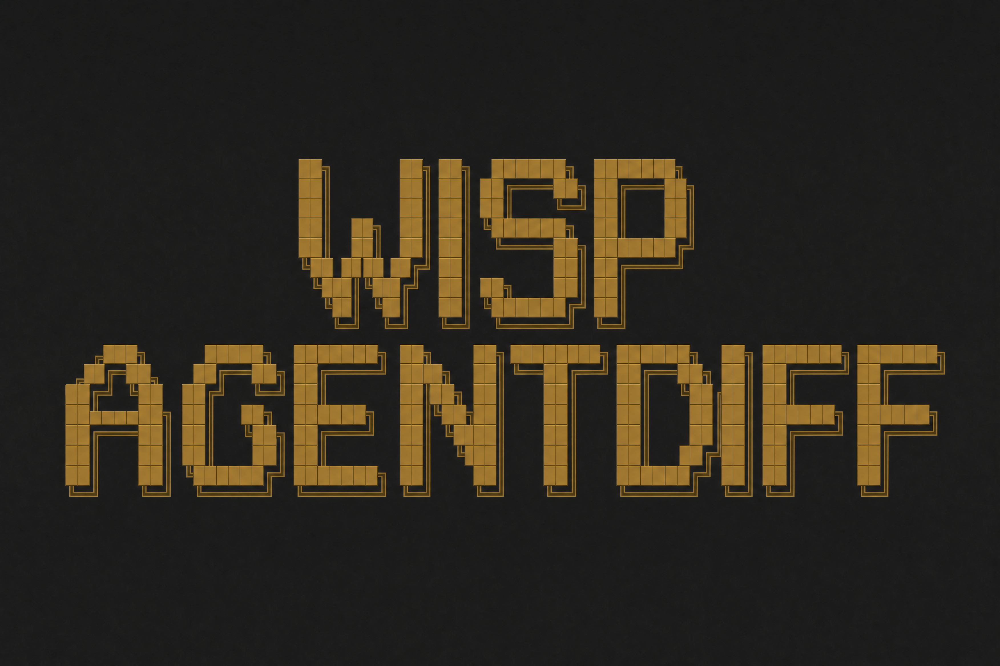
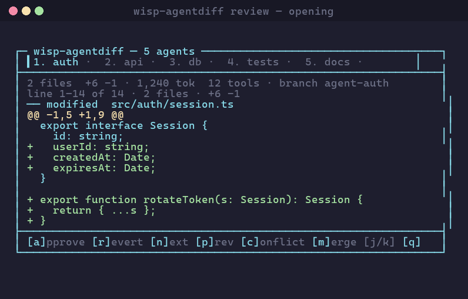
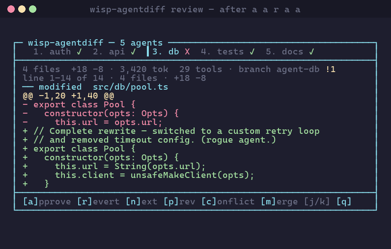
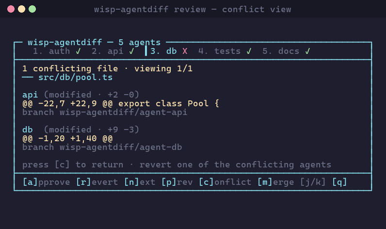

<p align="center">
  
</p>

<p align="center">
  
</p>

<p align="center">
  <a href="https://github.com/Samuel0101010/wisp-agentdiff/releases"></a>
  <a href="LICENSE"></a>
  
  =20">
  
  
</p>

# wisp-agentdiff

Per-agent diffs for Claude Code parallel subagent workflows.

Claude Code can fan out five subagents in parallel, each in its own git
worktree. When one of them goes rogue, the current workflow gives you one
button: keep everything, or throw everything away. `wisp-agentdiff` adds
the missing step in between — a tabbed TUI where each subagent's diff,
token usage, and tool-call list lives on its own pane, and one keystroke
approves, reverts, or merges it.

Five subagents refactor the auth module. Four edit cleanly; agent 3 also
rewrites `src/db/pool.ts` for no good reason. Open the review, press `n`
to step to agent 3, `r` to revert it, `m` to merge the other four. The
pool file never enters the working tree. If two approved agents touched
the same file, the merge refuses and points at the conflict — no silent
merge markers, no theirs/ours guessing.

## What it looks like

<p align="center">
  
</p>

<p align="center"><em>Opening — five subagents recorded, viewing <code>auth</code>'s diff.</em></p>

<p align="center">
  
</p>

<p align="center"><em>After <code>a a r a a</code> — <code>db</code> is reverted because it rewrote <code>src/db/pool.ts</code> for no good reason.</em></p>

<p align="center">
  
</p>

<p align="center"><em>Conflict view — <code>db</code> and <code>api</code> both touched <code>src/db/pool.ts</code>. The merge step refuses until one side is reverted.</em></p>

## Install

Two equivalent paths — pick one.

### Option A — Claude Code plugin (one-step, recommended)

Inside any Claude Code session:

```text
/plugin marketplace add Samuel0101010/wisp-agentdiff
/plugin install wisp-agentdiff@wisp-agentdiff
```

Claude Code clones the repo, registers the `wisp-agentdiff` skill and
`/review-agents` slash command, and wires the native `WorktreeCreate` /
`WorktreeRemove` hooks automatically. No `settings.json` edit required.

The hooks invoke `npx -y wisp-agentdiff@latest` on first use — first
worktree capture incurs a one-time ~1 s download, every subsequent
call is local-cached.

### Option B — npm + manual hook snippet

```bash
npx wisp-agentdiff install
```

That deploys the SKILL and `/review-agents` slash command into
`~/.claude/` and prints the hook snippet. Paste the snippet into
`~/.claude/settings.json` once:

```jsonc
{
  "hooks": {
    "WorktreeCreate": [
      { "matcher": "*", "hooks": [{ "type": "command", "command": "wisp-agentdiff hook worktree-create" }] }
    ],
    "WorktreeRemove": [
      { "matcher": "*", "hooks": [{ "type": "command", "command": "wisp-agentdiff hook worktree-remove" }] }
    ]
  }
}
```

From then on, every subagent Claude Code spawns with
`isolation: worktree` in its frontmatter is captured automatically.

## Verify the install

Right after `/plugin install` (or `npx wisp-agentdiff install`), the state
file doesn't exist yet — nothing has run. Two ways to confirm the plugin is
wired correctly before you trust it on real work:

```
node "${CLAUDE_PLUGIN_ROOT}/dist/index.js" doctor --repo .
```

Prints `OK` / `WARN` / `FAIL` for: git repo present, binary reachable,
plugin manifest reachable, state file present (and last modified when),
skill copy in `~/.claude/`. If everything is `OK` or only `WARN`s, the
plugin is healthy and just hasn't captured anything yet.

To actually exercise the hook path end-to-end, dispatch the canary
subagent the plugin ships:

```
Task(subagent_type: "wisp-self-test",
     description: "verify wisp-agentdiff hooks fire",
     prompt: "go")
```

It creates a single-line file inside an isolated worktree. The
`WorktreeCreate` hook should register it in
`.claude/wisp-agentdiff-state.json`; `WorktreeRemove` should capture the
diff. After it finishes, `/review-agents` will show one agent labelled
`wisp-self-test` (its real subagent_type, derived from the session
transcript) with the single-line file above as its diff. If you see
"no subagents recorded" after the canary runs, the hooks aren't firing —
open an issue with the output of `wisp-agentdiff doctor`.

## Use

After a Claude Code session has run 2+ subagents:

```bash
wisp-agentdiff review
```

— or say *"review the agents"* / *"show me what each agent did"* in chat
and the skill triggers it for you, or type `/review-agents`.

### Hotkeys

| Key | Action |
|-----|--------|
| `a` | approve active agent (auto-advances) |
| `r` | revert active agent (auto-advances) |
| `n` / `p` | next / previous agent |
| `c` | toggle cross-agent conflict view |
| `m` | merge all approved agents into HEAD |
| `j` / `k` | scroll diff |
| `q` | quit |

### Conflict gating

If two approved agents touched the same file, the merge step refuses and
shows you the overlap. You revert one side, then re-press `m`. The tool
will not write conflict markers, will not pick a winner, and will not
half-merge then abort — either all approved agents land or none do.

## Pruning

Over many sessions, subagent worktrees and their `wisp-agentdiff/agent-*`
branches accumulate because Claude Code persists worktrees until
session-end and `WorktreeRemove` rarely fires. Run `wisp-agentdiff prune`
to garbage-collect orphaned worktrees and branches; pass
`wisp-agentdiff prune --dry-run` first to preview what would be removed.
By default only entries older than `--older-than-hours 168` (one week)
are considered; pass `--all` to prune every captured wisp-agentdiff
worktree and branch regardless of age.

## How it works

```
Claude Code subagent ─► WorktreeCreate hook ─► wisp-agentdiff registers agent
                                   │
                                   ▼
                       isolated git worktree
                                   │
                Subagent edits + JSONL transcript captured
                                   │
                                   ▼
            WorktreeRemove hook ─► capture diff, remove worktree
                                   │
                                   ▼
              wisp-agentdiff review ─► tabbed TUI → [m] merges approved
```

We hook into Claude Code's native worktree lifecycle rather than wrapping
`git worktree add` ourselves, so the integration survives upstream Claude
Code changes and respects `.worktreeinclude`. Full architecture:
[`docs/architecture.md`](docs/architecture.md).

## Why not tazuna / plural / cwt

`tazuna`, `plural`, and `cwt` are worktree *orchestrators* — they spawn
isolated sessions but stop at isolation and leave the diff to `git diff`
by hand. Native Claude Code worktrees give you the isolation primitive
but no review surface — cleanup is all-or-nothing.
`wisp-agentdiff` fills the review step: aggregated TUI, per-agent token
+ tool-call telemetry, cross-agent conflict detection, single-key
approve / revert / merge.

## Related — `wisp-orchestrator`

If you need the *before* of the agent-crew lifecycle — visual team
builder, plan-as-DAG, live execution graph in the browser, hours-long
autonomous runs — see [**wisp-orchestrator**](https://github.com/Samuel0101010/wisp-orchestrator). Same author, complementary
workflow:

| Stage | Tool |
|------|------|
| Plan + spawn + watch multi-agent runs | **wisp-orchestrator** |
| Review + approve + merge the resulting per-agent worktrees | **wisp-agentdiff** *(this repo)* |

## Status & roadmap

v1.0 ships the core loop. Backlog and open questions live in
[`docs/roadmap.md`](docs/roadmap.md). Issues and PRs welcome.

## Develop

```bash
npm install
npm run check          # lint + typecheck + test + build
npm run test:watch     # iterating on a single module
npm run dev            # tsup watch build
```

CI matrix: Linux / macOS / Windows × Node 20 + 22.

## License

MIT — see [`LICENSE`](LICENSE).
